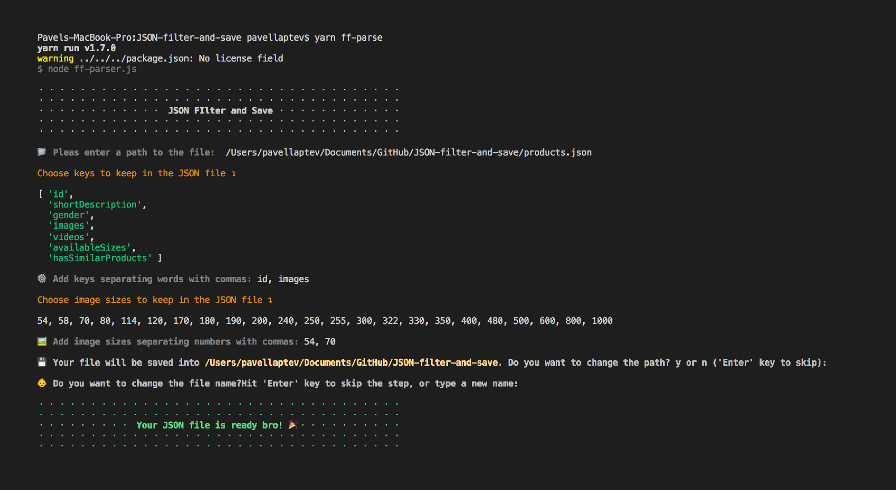

# terminal nodejs json filter

Filter JSON and save it into separate files.

## Installation

Choose a folder when you want to copy this package

`cd your-folder`

Clone the repasitory

`git clone https://github.com/PavelLaptev/terminal-nodejs-json-filter.git`

This script could be run only from the folder where the project is store. Use Terminal window in VS code or use usual MacOS terminal.

---

### Default usage

To run a default script for any JSON files:

**npm**

`npm start`

**Yarn**

`yarn start` or `yarn parse`

---

## Farfetch JSON parser

Farfetch mode contains one extra option. If you type a key `images` you could choose wich sizes do you want to keep in JSON.

**npm**

`npm run-script ff-parse`

**Yarn**

`yarn ff-parse`
